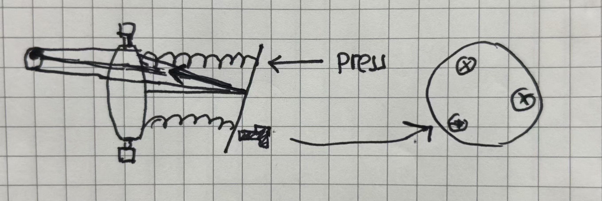

# 光纤及其调整
激光器发出的光一般需要通过耦合进入光纤来连接到不同的光路上。熟悉光纤的种类和耦合、准直方法是成功搭建光路必不可少的步骤。

## 光纤原理和模式

## 调整光纤准直器

光纤准直器含有一个**消色差凸透镜**(achromatic lens)和一个光纤端口。前者由两个螺丝()控制x-y平面的平动；后者位于一块由三个弹簧支撑的平板上，其弹簧松紧亦由三个螺丝控制，以调整俯仰角度。其示意图如下：

我们的目标是另出射的光束准直，也就是需要：
1. 出射平板平行于透镜
2. 透镜位于出射口中心
   
一般可以按如下步骤调整：
1. 检查透镜。若其显然不位于中心，粗调x-y螺丝以使其居中
2. 检查三个螺丝。若其未受力，拧紧未受力的螺丝。每次调整需要分清松紧的方向
3. 检查光束是否对称。更好的方法是使用**测距仪**对准水平和垂直方向的中心，其中水平方向只需要参考近处是否同出射光重叠，而垂直方向需要保证透镜与测距激光垂直，可以使用光学板作参考。然后通过调整三个弹簧将光斑调制对称，或者与中心重合。Tips: 在**远处**观察更容易；在观察对称行时候注意可能的反转
4. 检查光束是否对焦在无限远。通过同时拧紧/拧松三个螺丝来调整
5. 迭代2～4的过程直到误差落在允许范围

