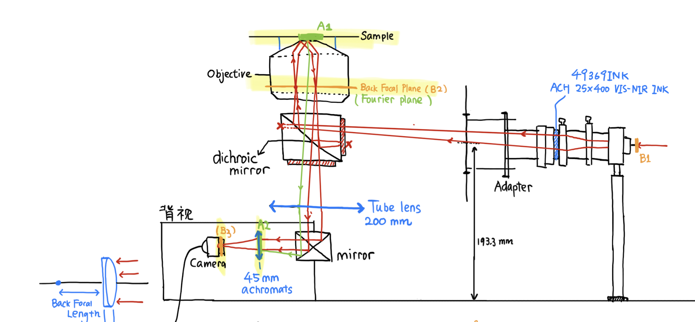
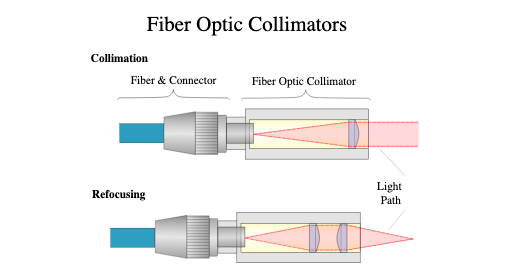

# TE2000U 基本配置
1043有两台科研级的尼康倒置显微镜，进门右手边(TE2000U)是组里最常用的荧光TIRF（全内反射）配置，示意图如下：

### 光路描述
- 激发光路
    - 耦合进光纤的激光经过**光纤准直器**(Fiber Collimator)变成一束较小的平行光(其调节方法见另一篇笔记)
    - 而后经过一组由两个凸透镜构成的**telescope型扩束器**(焦距和xxxx)扩束为直径约14mm的准直光
        
        
光纤准直器

    - 准直后的光束应该随z轴尺寸几乎不变，这样经过一面较长焦距的透镜(400mm)即可将激光较好地汇聚在物镜的后焦面上(图中B2)。
- 物镜后焦面事件
    - 后焦面上的点经过物镜变成平行光对样本进行照明
    - 若后焦面上汇聚的点不在中心，那么出射光将按一个角度照亮样品
    - 当角度大于临界角时，发生**全内反射(TIRF)**，反射光重新聚焦在后焦面对称的位置
- 出射光路
    - 出射光一般会被二相色镜滤掉以观察荧光
    - 若取下滤光片，则该光斑会经过一个**镜筒透镜(Tube Lens, 200nm)**，并在其后焦面(A2)处成一个**fourier变换像**。这个面同时是样本的共轭实像。
    - 显微镜右侧旋钮可以切换出射光光路，须**拧到听到弹簧声音**以切换
    - A2处再放一个凸透镜，则可在B3对后焦面进行成像（近似4-f系统）

整个系统中，B2-A1-B2-A2-B3是**交替的像面-傅立叶面**。了解这一点可以方便地对体系进行调整。

### 调整光斑和TIRF
1. 检查光纤耦合器出来的光斑是否对称，如果不对称则说明激光不准直，可按*Adjustment_of_fiber*小心调整xy旋钮
2. telescope的两个镜子首先要准直地放大光斑，这样通过同样准直的focus lens(左右方向保证准直)可达成epi照明，即光斑垂直从物镜出射，应看到对称的分部
3. 通过两面镜子的前面调整上下方向的旋钮来控制光斑在后焦面的位置(实际上看到成像的是反射光位置)。当打在入瞳边缘时候应形成全内反射。

整体的调整思路是：先准直和调对称、再达成TIRF。改变角度更好的方法是整体移动excitation部分，而非调整一面镜子的位置(这可能会让光线倾斜过多而损失一些光)。